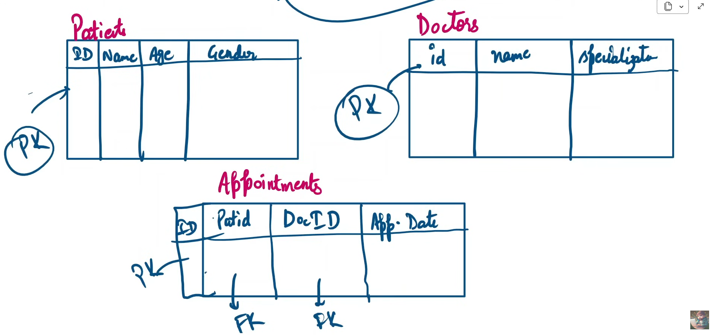

# 🏥 Hospital Management System
A Java-based Hospital Management System using MySQL and JDBC designed to streamline hospital operations and improve patient care management. This system allows healthcare providers to efficiently manage patient information, doctor details, and appointment scheduling, ensuring a smooth and organized workflow.

# ✨ Project Overview
The Hospital Management System is a robust application that helps hospitals and clinics manage their day-to-day activities. The system allows the following core functionalities:  
✅ **Patient Management** – Add, update, and retrieve patient details such as name, age, contact information, and medical history.  
✅ **Doctor Management** – Add, update, and retrieve doctor details including specialization, availability, and assigned patients.  
✅ **Appointment Scheduling** – Book, update, and manage appointments between doctors and patients.  
✅ **Doctor Availability Check** – Verify a doctor’s availability before scheduling an appointment.  
✅ **Secure Data Management** – Ensure that sensitive data is securely handled with proper access controls and validation.  

# 🎯 Use Cases
Hospital Reception – Manage patient registration and appointment booking.  
Doctors – Access patient details and manage schedules.  
Patients – Book appointments and view medical history.  
Administrators – Manage users, doctors, and hospital resources.  

# 🏆 Future Enhancements
✅ **Add authentication and authorization for secure access.**  
✅ **Implement real-time notifications for appointment reminders.**  
✅ **Introduce role-based access to separate patient, doctor, and admin access.**  
✅ **Develop a web-based interface using Spring Boot or a similar framework.**  
✅ **Integrate automated billing and payment processing.**  
